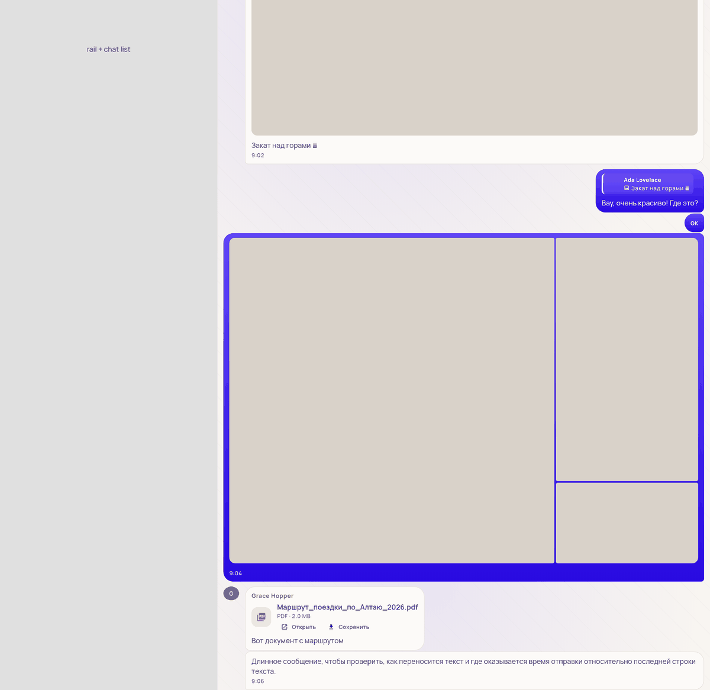
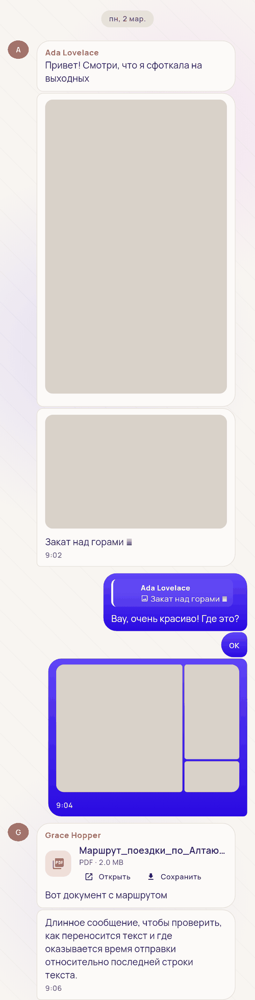
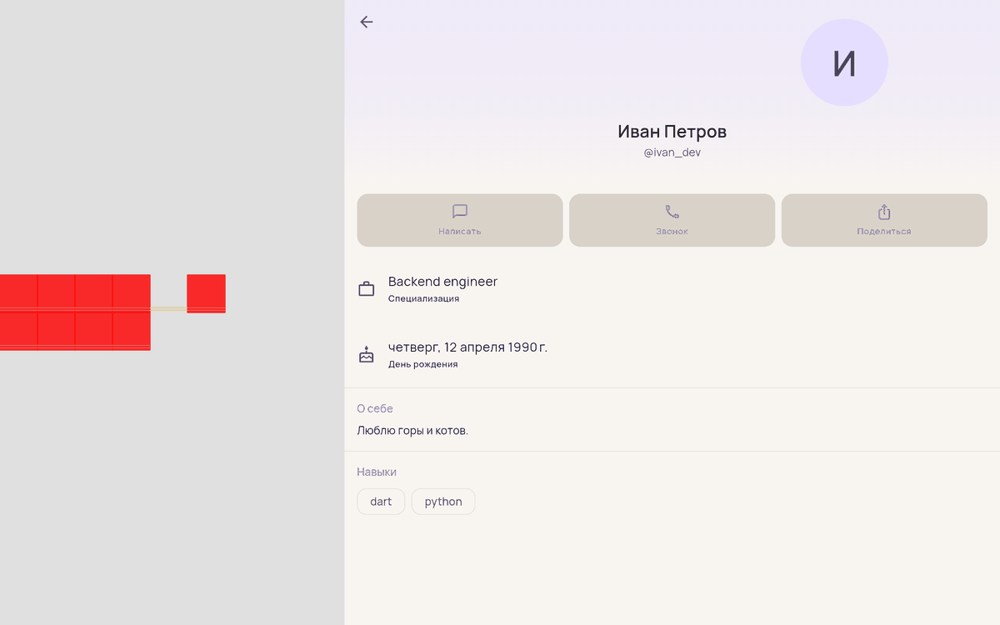
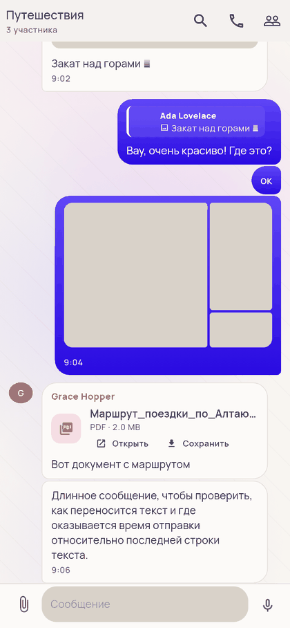
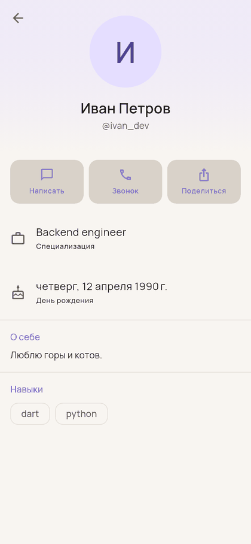
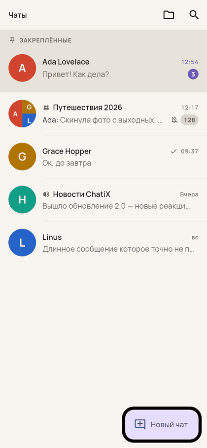
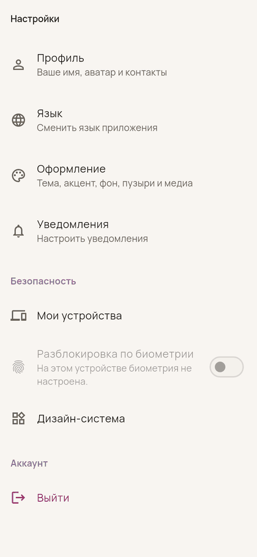

# ChatiX: аудит UI/UX и промты для доводки

Документ состоит из двух частей:

1. **Аудит.** Что сломано или выглядит плохо и почему. У каждого пункта
   указано место в коде (`файл:строка`). Это результат чтения кода и рендера
   экранов в тестовом окружении на ширинах 390 px (телефон), 800 px (планшет)
   и 1440 px (десктоп с двумя панелями). Скриншоты лежат в [`docs/audit/`](audit/).
2. **Промты.** 17 готовых заданий для ИИ-агента (Claude Code и подобных).
   Одно задание — одна сессия — один PR.

Предыдущий пакет (`PROMPTS_TELEGRAM_LIKE.md`, П-0…П-24) уже выполнен, и этот
его не повторяет. Здесь собрано то, что после него осталось кривым, и то,
чего не хватает до полноценного мессенджера.

---

## 0. Главное в двух словах

| # | Проблема | Насколько плохо | Промт |
|---|---|---|---|
| 1 | **Фото на весь экран.** На десктопе альбом занимает всю ширину чата (~1300×900 px), на телефоне вертикальное фото занимает больше половины экрана | 🔴 видно сразу | П-1 |
| 2 | **Аватар в профиле смещён вправо.** Центр считается по ширине окна, а не панели | 🔴 видно сразу | П-2 |
| 3 | **Аватары в группах — овалы, а не круги** (28×32 вместо 28×28) | 🔴 видно сразу | П-2 |
| 4 | Время стоит отдельной строкой под текстом, слева, и только у последнего сообщения серии. Пузыри от этого высокие, у остальных сообщений время не узнать | 🟠 | П-3 |
| 5 | Фото лежит внутри пузыря с цветной рамкой, а не «в край», как в Telegram | 🟠 | П-1, П-3 |
| 6 | `ref` в `dispose()` падает при каждом выходе из чата: черновик не сохраняется, контроллеры утекают. Та же ошибка в экране звонка ломает мини-плеер | 🔴 баг | П-4 |
| 7 | Удаление сообщения без подтверждения, а ошибка удаления не показывается | 🟠 баг | П-4 |
| 8 | Валидаторы входа и регистрации, создание чата и сброс пароля говорят по-английски | 🟠 | П-4 |
| 9 | На Android под иконкой написано `flutter_riverpod_clean_architecture`, иконка стандартная от Flutter, macOS-окно называется так же. Вероятен краш при запуске на Android (`MainActivity` лежит не в том пакете) | 🔴 | П-5 |
| 10 | Вкладка «Контакты» показывает каталог **всех** пользователей. API адресной книги (`/contacts/`: добавить, переименовать, избранное, импорт, блокировка) клиент не использует вообще | 🔴 нет функции | П-9, П-10 |
| 11 | В шапке чата нет «в сети / был(а) недавно», у групп нет аватара, нет меню «⋮». Кнопка «Участники» показывается даже в личном чате | 🟠 | П-6 |
| 12 | Нет эмодзи-панели, @-упоминаний и серверных черновиков. «Фото и видео» на деле выбирает только фото. Фото уходят без сжатия | 🟠 | П-7 |
| 13 | Десктоп: нет Enter-для-отправки, Esc, ↑ для правки, правого клика, вставки картинки из буфера, drag & drop. Формы растянуты на 1400 px | 🟠 | П-15 |
| 14 | Настройки — плоский список без карточки профиля, без «Конфиденциальности» и «Данных и памяти» | 🟡 | П-14 |
| 15 | Создание чата: техничная форма с сегментами «Личный / Группа / **Супергруппа** / Канал», медленный режим вводится числом секунд, в подсказке видно `message:send_admin_only` | 🟡 | П-13 |

---

## 1. Как пользоваться

1. **Один промт — одна сессия агента — один PR.** Если склеивать задания,
   падает качество.
2. Перед каждым промтом вставляйте блок **«Общий контекст»** (§1.1).
3. Порядок: Фаза 0 (П-1…П-5) — это баги, их стоит сделать первыми и по
   порядку. Остальные фазы можно переставлять.
4. После каждого промта:

```bash
dart run build_runner build --delete-conflicting-outputs && flutter analyze && flutter test
```

5. Промты с пометкой 🔴 упираются в бэкенд (см. §4). Делайте то, что можно на
   клиенте, а ограничение честно показывайте в UI.

### 1.1 Общий контекст (вставлять в начало каждого промта)

```text
Проект: Flutter-клиент мессенджера ChatiX (корень репозитория). Ориентир по UX — Telegram
(паттерны взаимодействия, размеры, плотность), но айдентика своя: палитра violet/mint,
шрифт Manrope, «якорный угол» у пузырей, mesh-обои. Не копировать иконки и тексты Telegram.

Бэкенд описан в ./api-docs.md — это единственный источник правды. Перед работой читай нужные
разделы, эндпоинты не выдумывай. Особенно §0 (неочевидное поведение): слэш в конце КАЖДОГО
пути, ошибки в body['error']['code'] (кроме 429 → body['detail']), presigned URL живут 300 с —
кэшировать по s3_key, а не по url.

Архитектура (соблюдать):
- Clean Architecture: lib/features/<feature>/{domain,data,presentation}; Riverpod 3
  (Notifier/AsyncNotifier), fpdart Either<Failure,T>, go_router (маршруты в
  lib/core/router/app_routes.dart).
- Общие UI-примитивы — lib/core/ui/**, токены — lib/core/theme/app_tokens.dart,
  ChatixTheme (ThemeExtension) — lib/core/theme/app_theme_extension.dart. Цвета и размеры
  брать оттуда, новые магические числа не плодить — добавлять токены.
- Адаптив: AppLayoutScope / AppBreakpoints (lib/core/router/app_layout.dart). Компактный
  режим < 600, средний (rail) 600–900, широкий ≥ 900 — две панели (список 360 px + чат).
  ⚠️ Никогда не считать раскладку от MediaQuery.size.width: панель уже окна. Ширину брать
  из LayoutBuilder (constraints) того места, где рисуешь.
- Любая пользовательская строка — в ARB (lib/l10n/arb/intl_*.arb, шаблон intl_en.arb,
  обязательно перевод в intl_ru.arb). Хардкод текста запрещён.
- В Riverpod 3 нельзя обращаться к ref в State.dispose() — это StateError. Нужное
  сохранять в поле заранее (в initState / didChangeDependencies).

Визуальная проверка обязательна (бэкенда в среде нет, поэтому через golden-тесты):
- Для каждого изменённого экрана или виджета добавь golden в двух размерах: телефон 390×844
  и десктоп 1440×900. Для десктопа имитируй две панели: Row(80 px rail + 360 px список +
  Expanded(экран)). Обе темы, light и dark.
- Помни: в flutter_test тени Material рисуются сплошной тёмной рамкой (debugDisableShadows).
  Это артефакт тестов, «чинить» его не надо.
- Перед сдачей открой свои PNG и посмотри на них глазами.

Definition of Done:
- flutter analyze — 0 ошибок и 0 новых warning; flutter test — зелёный;
- на новую логику есть юнит-тесты, на новую вёрстку — goldens (см. выше);
- все строки в ARB, светлая и тёмная тема выглядят одинаково законченно;
- в конце краткий отчёт: что сделано, что осталось, что упирается в бэкенд.
```

---

## 2. Аудит: что найдено

### 2.1 Лента и пузыри



**Фото «во весь чат».**

- `message_bubble.dart:401` и `chat_pending_bubble.dart:40`: максимальная
  ширина пузыря — `MediaQuery.size.width * 0.78`, то есть 78 % **окна**, а не
  панели чата. На десктопе с двумя панелями (1440 px) это 1123 px при ширине
  ленты около 1000 px: пузырь может занять весь чат.
- `album_mosaic.dart`: `AspectRatio` берёт всю доступную ширину пузыря. Любое
  фото растягивается до максимума.
- `album_layout.dart`: `minSingleRatio = 0.62`. Вертикальное фото на телефоне
  получается 278×448 dp, больше половины экрана. В Telegram примерно 230×330.
- Верхнего предела высоты медиа нет вообще.
- `message_actions_overlay.dart:332` использует тот же неверный источник
  ширины.
- Существующие goldens ленты сняты только на 400 px, поэтому десктопный
  вариант никто не видел.

**Медиа в рамке.** Альбом лежит внутри паддинга пузыря
(`MessageAttachments` внутри `Container(padding: bubblePaddingX/Y)`), поэтому
вокруг фото видна полоса фона пузыря, а у исходящих — фиолетовая рамка.
В Telegram медиа идёт в край, а у фото без подписи время лежит поверх
картинки в тёмной плашке.

**Время.** `_MessageMeta` — отдельная строка под текстом, выровненная по
левому краю (`crossAxisAlignment: start`). Показывается только у последнего
сообщения серии (`showMeta: item.endsGroup`, `chat_message_row.dart`).
В итоге:

- короткое сообщение «ок» превращается в пузырь из двух строк;
- у сообщений в середине серии время не узнать никак, кроме долгого нажатия
  и пункта «Подробнее»;
- в Telegram время стоит в той же строке, справа внизу, у каждого сообщения.

**Формат времени скачет.** В пузыре `9:02`
(`MaterialLocalizations.formatTimeOfDay`), в списке чатов `09:37`
(`DateFormat.Hm`, `chat_timestamp.dart:28`). День недели в списке пишется со
строчной («вс»). Плашка даты — «пн, 2 мар.» (`formatMediumDate`,
`chat_date_separator.dart:27`), а ожидается «2 марта» / «Сегодня» / «Вчера».

**Документ в пузыре.** Две текстовые кнопки «Открыть» и «Сохранить» делают
пузырь громоздким. В Telegram это иконка-кружок со стрелкой (скачать →
прогресс → открыть), имя файла и размер; «Сохранить» и «Поделиться» живут в
контекстном меню. Имя файла обрезается с конца, и пропадает расширение.



### 2.2 Аватары



- **Смещение вправо.** `profile_header.dart:93` и `chat_profile_header.dart:72`
  считают позицию по `MediaQuery.sizeOf(context).width`, то есть по ширине
  окна. С rail (80 px) и списком (360 px) аватар уезжает вправо на половину
  этой ширины, а имя под ним стоит по центру панели. На планшете смещение около
  40 px ([скриншот](audit/03_profile_tablet_avatar_offset.png)), на десктопе
  около 220 px.
- **Овалы.** `chat_message_row.dart:324–346`: колонка под аватар шириной 44
  минус отступ 12 даёт жёсткую ширину 32. `ChatAvatar` размера `xs` (28)
  внутри — это `SizedBox(28, 28)`, и он растягивается до 32×28. Клиппер
  рисует овал. В группе все лица приплюснуты.
- **Аватар не там.** Лицо стоит у **первого** сообщения серии. В Telegram оно
  у **последнего** (внизу серии) и «прилипает» при прокрутке.
- **Два разных компонента.** `ProfileAvatar` (`profile_avatar.dart`, сиреневый
  `primaryContainer`) используется в профиле, списке контактов и поиске.
  `ChatAvatar` (цвет по `user_id`) — в чатах. У одного и того же человека
  в списке чатов красный кружок, а в профиле сиреневый.
- В шапке чата аватар есть только у личных чатов (`chat_header.dart`).
  У группы и канала его нет, поэтому шапка выглядит недоделанной.

### 2.3 Баги поведения

- `chat_detail_screen.dart:142`: `ref.read(chatDraftsProvider…)` внутри
  `dispose()`. В Riverpod 3 это всегда `StateError`: «Using ref when a widget
  is about to or has been unmounted». Падает при каждом выходе из чата.
  Последствия: черновик не сбрасывается на диск, а `_textController`,
  `_composerFocus` и `_searchController` не освобождаются, потому что код
  после исключения не выполняется. Ошибку подтвердил прогоном экрана в тесте.
- `call_screen.dart:79`: тот же паттерн
  (`callScreenVisibleProvider…set(visible: false)` в `dispose`). Флаг
  «экран звонка открыт» не сбрасывается, поэтому мини-плеер звонка после
  выхода с экрана может не появиться.
- `chat_message_row.dart:154`: одиночное удаление вызывает
  `notifier.deleteMessage()` сразу, без подтверждения. Эта функция при ошибке
  **бросает** `Failure`, его никто не ловит, и пользователь ничего не видит.
  Массовое удаление при этом подтверждение спрашивает — поведение
  непоследовательное.
- Английский хардкод:
  - `auth_field_validators.dart` (все сообщения валидации входа и регистрации);
  - `reset_password_request_screen.dart:44,71`, `reset_password_confirm_screen.dart:77`;
  - `create_chat_screen.dart:129–150,198–200` (там же наружу видно имя права
    `message:send_admin_only`);
  - `user_search_field.dart:19,296`.
- `profile_screen.dart:513`: у пункта «Настройки» подпись «Ваше имя, аватар
  и контакты» — это текст пункта «Профиль» (`profileSettingsHint`).
- День рождения в профиле: «четверг, 12 апреля 1990 г.» — день недели лишний,
  возраста нет.

### 2.4 Бренд и упаковка

- `android/app/src/main/AndroidManifest.xml:21`:
  `android:label="flutter_riverpod_clean_architecture"`. Так подписана иконка
  на Android.
- `android/app/build.gradle*`: `namespace = "com.forgot.chatix"`, в манифесте
  `.MainActivity`, а класс лежит в пакете
  `com.ssoad.flutter_riverpod_clean_architecture`
  (`android/app/src/main/kotlin/com/ssoad/...`). Почти наверняка это
  `ClassNotFoundException` при запуске на Android — проверить.
- macOS: `macos/Runner/Configs/AppInfo.xcconfig:8,11` — `PRODUCT_NAME` и
  bundle id от шаблона (`com.ssoad...`). Окно и меню называются
  `flutter_riverpod_clean_architecture`.
- Windows: `windows/runner/main.cpp:30` (заголовок окна),
  `Runner.rc:95` (`InternalName`).
- `ios/Runner/Info.plist:22` и `web/index.html:26` — то же имя шаблона.
- Иконка запуска стандартная от Flutter. В `flutter_launcher_icons.yaml`
  остались заглушки `#hex_color`, файла `assets/icon/app_icon.png` нет.
  `assets/images/*.png.placeholder` — заглушки.
- `web/manifest.json`: цвета `#0175C2` (синий Flutter) вместо фирменного
  violet.
- На экране входа логотип — стандартная иконка `chat_bubble_outline`.
  Заголовок AppBar «Login» дублирует «Welcome back». На планшете форма
  растянута на всю ширину.

### 2.5 Экран чата



- **Шапка** (`chat_header.dart`, `chat_detail_screen.dart:269–320`):
  - у личного чата под именем `@username`, а не статус «в сети / был(а)
    недавно». Провайдер онлайна уже есть (`chatPeerOnlineProvider`, его
    использует список чатов);
  - у групп нет аватара и счётчика «N в сети»;
  - три иконки подряд (поиск, звонок, участники), меню «⋮» нет. Кнопка
    «Участники» есть даже в личном чате;
  - нет быстрых действий: выключить звук, очистить, заблокировать,
    покинуть/удалить.
- **Композер** (`composer/*`):
  - нет кнопки эмодзи и эмодзи-панели;
  - нет автодополнения `@упоминаний`, хотя подсветка упоминаний в тексте есть;
  - черновики только локальные (`chat_drafts` в SharedPreferences). Серверный
    `ChatDTO.draft` и `PATCH /state/ {draft}` не используются, хотя use case
    уже есть. Это описано в `docs/BACKEND_GAPS.md` §4.
- **Вложения** (`chat_attachment_picker.dart:25`):
  - пункт «Фото и видео» вызывает `pickMultiImage`, поэтому видео из системной
    галереи не выбрать;
  - фото уходят без сжатия: снимок 12 Мп весит 5–10 МБ, долго грузится и
    расходует трафик. В Telegram по умолчанию сжатие около 1280–2560 px, а
    «отправить как файл» — отдельная опция.
- **Видео в ленте** — тёмная плитка с иконкой play, без кадра-превью. API
  постеров не хранит (`message_album.dart` `_VideoTile`).
- **Просмотрщик медиа** (`media_viewer_screen.dart`): есть зум, свайп-вниз и
  сохранение. Нет двойного тапа для зума, «Поделиться», «Переслать»,
  «Показать в чате», счётчика «3 из 12» и подписи к фото.

### 2.6 Люди: контакты, профиль, блокировка



- **Вкладка «Контакты»** (`profiles_list_screen.dart`) — это
  `GET /profiles/`, каталог всех пользователей системы:
  - поиск запускается только по Enter (`onSubmitted`), подсказок по мере
    ввода нет;
  - поле в стиле `OutlineInputBorder`, выбивается из дизайн-системы;
  - нет статуса онлайн.
- **API адресной книги не используется вообще.** `GET/POST/PATCH/DELETE
  /contacts/`, `/contacts/import/`, `/contacts/search/`,
  `/contacts/blocked/`, `POST/DELETE /contacts/{id}/block/` — в `lib/` нет ни
  одного обращения к этим путям (api-docs §4.7–4.13). Значит, нельзя:
  добавить в контакты, дать локальное имя, отметить избранным, увидеть
  взаимность, импортировать, заблокировать.
- **Профиль человека** — наследие шаблона: «Специализация» и «Навыки»
  (`dart`, `python`) больше подходят бирже фриланса, чем мессенджеру.
  - Нет строки `@username` с копированием и QR для «Поделиться».
  - Нет общих медиа с этим человеком, кнопки «Звук» и пункта «Заблокировать».
  - Кнопки быстрых действий бежевые с фиолетовым текстом на бежевом фоне и
    выглядят грязно.
- **Два экрана одного человека.** `ProfileScreen` (из контактов) и
  `ChatProfileScreen` (из шапки личного чата) — разные экраны с разным
  набором информации.

### 2.7 Навигация, список чатов, создание чата, настройки

 

- **Вкладки:** Чаты / Контакты / **Уведомления** / Настройки
  (`app_shell.dart`). Отдельная вкладка «Уведомления» — наследие шаблона:
  в мессенджере уведомления — это и есть чаты. Её место — колокольчик в шапке
  списка или раздел в настройках.
- **Список чатов** в целом хороший: свайпы, долгое нажатие, черновик,
  отключённый звук, пины. Недостатки:
  - заголовок «Чаты» мелкий;
  - нет постоянной строки поиска сверху;
  - у закреплённых нет значка 📌 в самой строке, только секция «ЗАКРЕПЛЁННЫЕ»;
  - серверный черновик не показывается (см. выше).
- **Создание чата** (`create_chat_screen.dart`) — форма разработчика:
  - сегменты Личный / Группа / Супергруппа / Канал (четыре в ряд на 390 px);
  - медленный режим вводится сырым числом секунд;
  - аватар группы при создании не выбрать;
  - английские подсказки.

  В Telegram этот путь устроен так: «Новое сообщение» → список контактов с
  поиском, сверху «Новая группа» / «Новый канал». Тап по человеку сразу
  открывает личный чат. Группа: выбрать участников (чипы) → «Далее» →
  название и фото.
- **Настройки** (`settings_screen.dart`) — плоский список:
  - нет карточки профиля сверху;
  - нет разделов «Конфиденциальность» (блокировки, устройства, код-пароль)
    и «Данные и память» — кэш и автозагрузка спрятаны внутри «Оформления»;
  - нет пункта «Папки» и раздела «О приложении» с версией;
  - «Дизайн-система» видна в debug-сборке — это нормально, но лучше спрятать
    в скрытое dev-меню.

### 2.8 Десктоп и планшет

Судя по `.DS_Store`, приложение запускают и на macOS. Там видно больше всего
проблем:

- `Shortcuts` и `LogicalKeyboardKey` нигде не используются. Нет Enter для
  отправки, Shift+Enter для переноса, Esc для отмены ответа, правки или
  поиска, ↑ для правки последнего сообщения, Ctrl/Cmd+F для поиска,
  Ctrl/Cmd+K для быстрого перехода в чат.
- `onSecondaryTap` и `MouseRegion` нигде не используются: правый клик ничего
  не делает, hover-состояний нет. В Telegram Desktop при наведении на пузырь
  появляются «ответить» и «реакция».
- Нет вставки картинки из буфера и перетаскивания файлов в чат.
- Формы и списки (вход, настройки, профиль, создание чата) растягиваются на
  всю ширину. Ограничение ширины контента не задано нигде.

---

## 3. Промты

### ФАЗА 0 — баги, которые видно сразу

---

#### П-1. Размер фото и ширина пузырей

```text
[Общий контекст]

Проблема (воспроизведена рендером): фото и альбомы в ленте растягиваются на всю ширину пузыря,
а пузырь — на 78% ширины ОКНА. На десктопе (две панели, окно 1440) альбом занимает ~1300×900 px,
то есть весь чат; на телефоне вертикальное фото 278×448 dp — больше полэкрана.
Причины:
- lib/features/chat/presentation/widgets/message_bubble.dart:401 и chat_pending_bubble.dart:40 —
  maxWidth = MediaQuery.size.width * 0.78 (ширина окна, а не ленты);
- message_actions_overlay.dart:332 — тот же источник ширины;
- album_mosaic.dart — AspectRatio забирает всю доступную ширину;
- album_layout.dart — minSingleRatio 0.62 и нет предела по высоте;
- медиа лежит внутри паддинга пузыря (рамка вокруг фото).

Сделай:
1. Метрики ленты. В ChatFeed оберни ленту в LayoutBuilder и опубликуй через InheritedWidget
   (например ChatFeedMetrics) ширину и высоту ВЬЮПОРТА ЛЕНТЫ. Все расчёты ширины пузырей,
   pending-пузырей и оверлея меню бери отсюда. MediaQuery.size для раскладки ленты больше нигде
   не используется.
2. Токены в app_tokens.dart (ChatLayout или аналог):
   - bubbleMaxWidth = min(feedWidth * 0.80, 560) — для текста;
   - mediaMaxWidth  = min(feedWidth * 0.72, 380) на телефоне и ≤ 420 на широком экране;
   - mediaMaxHeight = min(feedViewportHeight * 0.5, 440);
   - mediaMinWidth = 140, mediaMinHeight = 100.
   Вынеси расчёт размера одиночного медиа в чистую функцию (например
   MediaBoxSize.fit(ratio, maxW, maxH, minW, minH)): вписать с сохранением пропорций, при
   экстремальных пропорциях обрезать (cover), но не выходить за пределы. Покрой юнит-тестами:
   портрет 9:16, ландшафт 16:9, панорама 4:1, квадрат, «неизвестно» (null) — на ширинах
   390 и 1000.
3. AlbumMosaic получает явную ширину (mediaMaxWidth), а не «всю доступную». Высоту альбома
   тоже ограничь mediaMaxHeight (масштабируй мозаику целиком).
4. Пузырь с медиа обнимает медиа: ширина пузыря = ширина медиа, подпись переносится по этой
   ширине (не раздувает пузырь). Если подпись есть, медиа идёт в край сверху и по бокам
   (без паддинга), углы медиа совпадают с углами пузыря (внешние — радиус пузыря,
   внутренние швы альбома — 2–4 px), подпись — с обычным паддингом ниже.
5. Медиа без подписи: фон пузыря не рисуется вообще, картинка и есть пузырь (со своей
   формой BubbleShape). Время и галочки лежат поверх фото в правом нижнем углу: тёмная
   полупрозрачная плашка (≈ black 45%, белый текст, радиус full, отступ 6 px).
6. На очень широкой панели (feedWidth > 1000) ограничь колонку ленты и композера
   ~860 px по центру (как «адаптивная раскладка» Telegram Desktop). Обои остаются во всю ширину.
7. То же применить к pending-пузырю (отправляемое сообщение) и к копии пузыря в оверлее
   контекстного меню — размеры должны совпадать один в один.

Проверка: goldens ленты с сообщениями [текст, одиночный портрет, одиночный ландшафт,
альбом из 3, альбом из 5, фото с подписью, длинный текст] на 390×844 и 1440×900 (две панели),
light/dark. Открой PNG и убедись: на десктопе медиа ≤ 420 px в ширину, на телефоне портрет
не выше ~половины экрана, рамки вокруг фото нет.
```

---

#### П-2. Аватары: центр, круги, единый компонент

```text
[Общий контекст]

Проблемы (воспроизведены рендером):
a) Аватар в профиле смещён вправо относительно имени: на десктопе ~220 px, на планшете ~40 px.
   Причина: lib/features/profile/presentation/widgets/profile_header.dart:93 и
   lib/features/chat/presentation/widgets/profile/chat_profile_header.dart:72 считают
   avatarLeft от MediaQuery.sizeOf(context).width — ширины окна, а экран живёт в панели уже окна
   (rail 80 px + список 360 px).
b) В групповом чате аватары рисуются овалами 32×28. Причина:
   lib/features/chat/presentation/widgets/chat_message_row.dart:324–346 — колонка 44 px минус
   отступ 12 даёт ЖЁСТКУЮ ширину 32, а ChatAvatar(xs=28) — это SizedBox(28,28), который
   растягивается до 32×28; _CircleClipper рисует овал.
c) В ленте аватар стоит у первого сообщения серии; в Telegram — у последнего (внизу).
d) Два разных аватара: ProfileAvatar (profile_avatar.dart, фон primaryContainer) и ChatAvatar
   (цвет по user_id). Один и тот же человек в списке чатов красный, в профиле сиреневый.
e) В шапке чата аватар есть только у direct; у group/channel его нет.

Сделай:
1. Оба SliverPersistentHeaderDelegate: внутри build оберни в LayoutBuilder и считай всю
   геометрию от constraints.maxWidth. Добавь goldens профиля и профиля чата в панели шириной
   1440−441 и 800−81: центр аватара совпадает с центром имени (допуск 1 px) — проверь также
   тестом на координаты (tester.getCenter).
2. ChatAvatar сделай устойчивым к чужим ограничениям: снаружи Align(widthFactor: 1,
   heightFactor: 1) или SizedBox.square внутри UnconstrainedBox-подобной обёртки, чтобы в жёстких
   ограничениях он оставался кругом нужного диаметра. Тест: ChatAvatar в
   ConstrainedBox(tight 32×28) → отрисованный размер 28×28.
3. Гаттер аватара в ленте: ширина = отступ + диаметр + зазор (возьми из токенов), аватар
   выровнен по НИЖНЕМУ краю ПОСЛЕДНЕГО пузыря серии (item.endsGroup). Имя автора остаётся над
   первым пузырём. Опционально (если не ломает производительность): «липкий» аватар,
   который едет вниз, пока серия видна.
4. Удалить ProfileAvatar: везде (профиль, список контактов, поиск людей, редактирование
   профиля, участники) использовать ChatAvatar с AvatarSource.variants(profile.avatars) и
   цветом по user_id. Один человек = один цвет в любом месте приложения.
5. Шапка чата: аватар у всех типов чатов — фото группы, если есть; иначе ChatAvatarMosaic из
   members_preview; у канала — инициал/иконка. Hero в профиль чата сохранить.
6. Размеры: в ленте 32 (не 28), в списке чатов 52–54, в шапке 40, в профиле 96–112. Если для
   этого нужен новый ChatAvatarSize — добавь, не используй FittedBox как костыль.

Goldens: лента группы (несколько серий), список контактов, профиль — телефон и десктоп,
light/dark. Убедись глазами, что все аватары круглые и по центру.
```

---

#### П-3. Пузырь как в Telegram: время в строке, компактность, документы

```text
[Общий контекст]
Опирается на П-1.

Проблемы: время (_MessageMeta в message_bubble.dart) — отдельная строка ПОД текстом, по левому
краю, и только у последнего сообщения серии (showMeta: item.endsGroup в chat_message_row.dart).
Пузырь «ок» получается двухэтажным, а время промежуточных сообщений не узнать. Документ в пузыре
(document_attachment_row.dart) — две текстовые кнопки «Открыть»/«Сохранить», громоздко.

Сделай:
1. Время и галочки в строке с текстом, справа внизу, как в Telegram:
   - если последняя строка текста + ширина меты + зазор помещаются в maxWidth — мета стоит на той
     же строке справа;
   - если нет — мета переносится на новую строку и прижимается вправо.
   Надёжный способ: в конец текста добавить невидимый WidgetSpan-«распорку» шириной меты
   (измерить TextPainter'ом), а саму мету спозиционировать в правый нижний угол через Stack.
   Для RTL — зеркально. Работает и для подписи под медиа.
2. Время показывать у КАЖДОГО сообщения (оно больше не добавляет высоту). Отметку «изменено»
   оставить, галочки — только у своих.
3. Уменьшить вертикальный паддинг пузыря примерно на 2–3 px во всех плотностях (раньше его
   раздувала отдельная строка меты), сверить в compact/cozy/comfortable.
4. Цитата-ответ (message_reply_quote.dart): миниатюра 36 px со скруглением 4 и отступом от
   полосы, а не вплотную; при неудаче загрузки миниатюры — иконка типа вместо пустого квадрата.
5. Документ: слева круг 44 px с иконкой (скачать → кольцо прогресса → иконка типа файла /
   «открыть»), справа имя (до 2 строк, обрезка ПОСЕРЕДИНЕ, чтобы расширение было видно:
   «Маршрут_поездк…2026.pdf») и «2.0 МБ · PDF». Тап по строке — скачать или открыть.
   «Сохранить», «Поделиться», «Показать в папке» перенеси в контекстное меню сообщения.
   Единицы — локализованные (МБ/КБ).
6. Исходящий градиент (app_theme_extension.dart): проверь, что тёмный хвост градиента не
   «кричит». Предложи мягче (меньше разброс по светлоте) и добавь в Оформление переключатель
   «Пузыри: градиент / сплошной цвет». Контраст меты и текста ≥ 4.5:1 на обоих концах — есть
   AppContrast, используй.
7. Плашка даты (chat_date_separator.dart): «Сегодня», «Вчера», «2 марта», с годом —
   только если год не текущий («2 марта 2025»). Время везде в одном формате: в ru 24-часовой с
   ведущим нулём, «09:02» (сейчас пузырь пишет 9:02, а список — 09:37). День недели в списке
   чатов — с заглавной («Вс»). Сделай общий форматтер и используй его везде.

Goldens: матрица пузырей (короткий/длинный текст, с ответом, пересланный, с подписью под фото,
документ, отредактированный; свой/чужой; compact/cozy) на 390 и 1440, light/dark. Юнит-тест
форматтеров дат и времени для ru и en.
```

---

#### П-4. Баги поведения и тексты

```text
[Общий контекст]

Исправь найденные баги. На каждый — регрессионный тест.

1. lib/features/chat/presentation/screens/chat_detail_screen.dart:142 — ref.read(...) в
   dispose(). В Riverpod 3 это StateError при КАЖДОМ закрытии чата: черновик не сохраняется,
   _textController/_composerFocus/_searchController не освобождаются. Сохрани notifier
   черновиков в поле в initState и вызывай flush через поле. Тест: открыть и закрыть
   ChatDetailScreen → нет исключений, flush вызван.
2. lib/features/chat/presentation/screens/call_screen.dart:79 — то же самое для
   callScreenVisibleProvider. Из-за этого флаг «экран звонка открыт» не сбрасывается и
   мини-плеер звонка может не появиться. Тест: после ухода со звонка мини-плеер виден.
3. Найди и исправь любые другие обращения к ref в dispose/deactivate по всему lib/.
4. Удаление сообщения (chat_message_row.dart:154): сейчас без подтверждения, а Failure из
   deleteMessage() никто не ловит — пользователь не видит ошибку. Сделай:
   - диалог «Удалить сообщение? Оно исчезнет у всех участников» (API удаляет у всех,
     «только у себя» в API нет — см. api-docs §5.4; чекбоксов «удалить у всех» не выдумывай);
   - ошибку показывай AppSnackbar.failure с текстом из failure_messages;
   - одиночное и массовое удаление идут через один и тот же путь.
5. Английский хардкод — всё в ARB (en + ru + остальные локали проекта):
   - lib/features/auth/presentation/utils/auth_field_validators.dart (все errorText);
   - reset_password_request_screen.dart:44,71; reset_password_confirm_screen.dart:77;
   - create_chat_screen.dart:129–150,198–200 (и убрать из UI имя права message:send_admin_only);
   - profile/presentation/widgets/user_search_field.dart:19,296.
   Добавь тест (или расширь arb_completeness_test), который грепает presentation-слой на
   строковые литералы в Text()/labelText/hintText/helperText/errorText, чтобы хардкод не
   возвращался.
6. profile_screen.dart:513 — у пункта «Настройки» подпись от пункта «Профиль»
   (profileSettingsHint). Дай свою подпись: «Уведомления, оформление, конфиденциальность».
7. День рождения в профиле: без дня недели, с возрастом — «12 апреля 1990 (36 лет)»; если
   год не указан или скрыт — только день и месяц.

Отчёт: список исправленных мест, ссылки на тесты.
```

---

#### П-5. Имя, иконка и логотип приложения

```text
[Общий контекст]

Приложение до сих пор подписано именем шаблона:
- android/app/src/main/AndroidManifest.xml:21 — android:label="flutter_riverpod_clean_architecture";
- android: namespace/applicationId = com.forgot.chatix, а MainActivity лежит в
  android/app/src/main/kotlin/com/ssoad/flutter_riverpod_clean_architecture/ с package
  com.ssoad... При android:name=".MainActivity" это почти наверняка ClassNotFoundException на
  старте — проверь и исправь (перенести в com/forgot/chatix, поправить package);
- macos/Runner/Configs/AppInfo.xcconfig:8,11 — PRODUCT_NAME и PRODUCT_BUNDLE_IDENTIFIER
  (com.ssoad...), а также macos/Runner.xcodeproj (схема, pbxproj);
- windows/runner/main.cpp:30 (заголовок окна), windows/runner/Runner.rc:95;
- ios/Runner/Info.plist:22, web/index.html:26 (apple-mobile-web-app-title);
- .github/workflows/flutter_ci_cd.yml — упоминания шаблона.
В репо есть ./rename_app.sh — можно использовать, но результат проверь руками по списку выше.

Сделай:
1. Отображаемое имя «ChatiX» на всех платформах; bundle/application id — com.forgot.chatix
   везде (iOS/macOS тоже, если это не ломает подпись — тогда опиши в отчёте, что сделать руками).
2. Логотип: простой фирменный знак (пузырь с «якорным углом», violet #6E56F8 → indigo градиент,
   белая «X» или искра). Нарисуй как виджет (CustomPainter) в lib/core/ui/brand/chatix_logo.dart +
   экспортируй PNG 1024×1024 в assets/icon/app_icon.png (и foreground для adaptive icon на
   прозрачном фоне). Заполни flutter_launcher_icons.yaml (убери «#hex_color», задай
   adaptive_icon_background/foreground, web theme_color/background_color = фирменные) и
   сгенерируй иконки для android/ios/macos/web/windows.
3. web/manifest.json: theme_color и background_color — фирменные, не #0175C2.
4. Сплэш: flutter_native_splash (или нативные ресурсы) — фон canvas темы + логотип, отдельно
   для тёмной темы.
5. Логотип на экране входа, регистрации и в онбординге вместо Icons.chat_bubble_outline;
   удали или замени assets/images/*.png.placeholder и lib/examples, если они попадают в сборку.

Проверка: flutter build apk --debug проходит; в отчёте — скриншот/описание иконки, перечень
изменённых платформенных файлов.
```

---

### ФАЗА 1 — экран чата

---

#### П-6. Шапка чата и меню «⋮»

```text
[Общий контекст]
Опирается на П-2 (аватар в шапке у всех типов чатов).

Сейчас (chat_header.dart, chat_detail_screen.dart:269–320): у direct под именем @username, а не
статус; у групп нет аватара; три иконки (поиск, звонок, участники) — «участники» видны даже в
личном чате; меню «⋮» нет.

Сделай:
1. Подзаголовок:
   - direct: «в сети» (accent-цвет) / «был(а) недавно» / «был(а) в 14:05» / «был(а) вчера».
     Онлайн уже считается (chatPeerOnlineProvider, presence из GET members include_presence=true
     и WS). Если точного last seen нет в API — показывай только «в сети» / ничего, не выдумывай
     время. Сверь с api-docs.
   - group/supergroup: «12 участников, 3 в сети».
   - channel: «1 240 подписчиков».
   - «печатает…» — оставить как есть (бэкенд typing не шлёт, индикатор не фейкаем).
2. Действия в AppBar: звонок (если доступен) + «⋮». Поиск по чату переезжает в меню
   (и в профиль чата). Кнопку «Участники» убрать из AppBar совсем — участники открываются из
   профиля чата.
3. Меню «⋮» (с учётом прав, chat_permissions.dart):
   - Поиск; Выключить/включить уведомления (с вариантами на 1 ч / 8 ч / 2 дня / навсегда —
     PATCH /chats/{id}/state/ notifications_muted_until);
   - Закрепить/открепить чат; В архив;
   - Выбрать сообщения;
   - для direct: Заблокировать пользователя (после П-10), Удалить чат;
   - для группы: Покинуть группу; для владельца/админа — Управление группой.
4. Тап по шапке открывает профиль чата (как сейчас); в two-pane — не терять выбранный чат.
5. Режим выделения: заголовок «Выбрано: 3», действия Копировать/Переслать/Удалить, Esc и
   «назад» выходят из режима.

Goldens шапки: direct онлайн/офлайн, группа без фото (мозаика), канал; телефон и десктоп.
```

---

#### П-7. Композер: эмодзи, упоминания, черновики, отправка медиа

```text
[Общий контекст]

Сделай по шагам (каждый шаг — отдельный коммит):
1. Эмодзи-панель: кнопка-смайлик слева в поле ввода, по тапу вместо клавиатуры открывается
   панель (высота = высоте последней клавиатуры) с категориями, поиском и «Недавними».
   Переключение клавиатура ↔ панель без прыжков ленты. Можно взять пакет emoji_picker_flutter
   (проверь совместимость с текущим Flutter) и стилизовать под ChatixTheme, либо свою сетку.
   «Недавние» объедини с recent_reactions_provider (одна история эмодзи на приложение).
2. @-упоминания: при вводе «@» показывать над композером список участников чата (фильтр по
   username и display_name, с аватарами), выбор вставляет «@username ». Только для групп и
   каналов. Подсветка упоминаний в пузыре уже есть (message_linkifier.dart) — сверь, что
   формат совпадает.
3. Серверные черновики: ChatDTO.draft + draft_updated_at и PATCH /chats/{id}/state/ {draft}
   (api-docs §5.2, UpdateChatStateUseCase.setDraft уже есть). Правило конфликта: побеждает более
   свежий draft_updated_at; запись с дебаунсом ≥ 1.5 с и не чаще лимита (60/мин). Локальный
   chat_drafts оставить как офлайн-кэш. Список чатов показывает «Черновик: …» из объединённого
   источника. См. docs/BACKEND_GAPS.md §4.
4. Выбор медиа (lib/features/chat/presentation/utils/chat_attachment_picker.dart:25): пункт
   «Фото и видео» вызывает pickMultiImage — видео не выбрать. Замени на pickMultipleMedia
   (с limit), MIME для видео бери из файла.
5. Сжатие фото перед отправкой: по умолчанию длинная сторона ≤ 2560 px, JPEG ~85% (или HEIC→JPEG),
   EXIF-ориентацию применить, геотеги удалить. На экране предпросмотра (media_preview_screen.dart)
   — переключатель «Сжать фото» и пункт «Отправить как файл» (тогда уходит как file, без сжатия).
   Сжатие в изоляте, прогресс на плитке.
6. Подпись к альбому в предпросмотре (одна на сообщение — так в API), счётчик символов
   (ComposerCounter) не наезжает на кнопки.

Тесты: фильтр упоминаний, слияние черновиков (локальный vs серверный по времени), сжатие
(размер результата ≤ лимита, ориентация). Goldens композера: пусто / текст / ответ / правка /
эмодзи-панель / список упоминаний; телефон и десктоп.
```

---

#### П-8. Просмотрщик медиа и превью видео

```text
[Общий контекст]

Сейчас media_viewer_screen.dart умеет зум (InteractiveViewer), свайп-вниз и сохранение.
Видео в ленте — тёмная плитка без кадра (message_album.dart _VideoTile): API постеров не хранит.

Сделай:
1. Двойной тап — зум ×2.5 в точку тапа и обратно (анимированно).
2. Верхняя панель: автор + дата/время, счётчик «3 из 12» (по всему медиа чата, порядок —
   chat_media_gallery.dart). Нижняя панель: подпись сообщения (сворачиваемая, если длинная),
   кнопки Поделиться (share_plus), Переслать (ForwardFlow), Показать в чате, Сохранить, Удалить
   (по правам). Тап по фото прячет/показывает панели.
3. Лента миниатюр внизу на десктопе/планшете; стрелки ← → и колесо мыши листают; Esc закрывает.
4. Видео: нормальные контролы (play/pause, перемотка с превью времени, громкость на десктопе,
   скорость), автоповтор для коротких (< 15 с) без звука в ленте — НЕ делать автоплей, только в
   просмотрщике.
5. Постер видео без бэкенда: после загрузки файла видео в кэш генерируй первый кадр
   (video_thumbnail или video_player + snapshot), кэшируй JPEG по s3_key рядом с файлом. Плитка в
   ленте показывает постер + длительность; пока постера нет — текущая тёмная плитка.
   Для своих отправляемых видео постер делай ещё до загрузки.
6. Hero-переход сохранить (attachmentHeroTag), без «квадратного щелчка».

Тесты: навигация по индексам, генерация ключа постера, закрытие по Esc. Goldens просмотрщика:
фото с подписью, видео на паузе; телефон и десктоп.
```

---

### ФАЗА 2 — люди

---

#### П-9. Адресная книга (API /contacts/) 🔴частично

```text
[Общий контекст]

Сейчас вкладка «Контакты» (lib/features/profile/presentation/screens/profiles_list_screen.dart)
— это GET /profiles/, каталог ВСЕХ пользователей, поиск только по Enter. API адресной книги
(api-docs §4.7–4.13) в клиенте не используется вообще. Реализуй его отдельной фичей
lib/features/contacts/{domain,data,presentation}.

1. Data/domain по api-docs:
   - GET /contacts/ — курсор after_contact_id, дельта-синк по version (приходит только на
     последней странице) → updated_after; upsert по contact_id; полный перечит раз в N дней и
     при входе на новом устройстве (удаления через дельту не приходят!);
   - POST /contacts/ {user_id | username, first_name?, last_name?}; ошибки
     SELF_CONTACT_NOT_ALLOWED, CONTACT_BLOCKED, CONTACT_LIMIT_EXCEEDED, NOT_FOUND_CONTACT_TARGET;
   - PATCH /contacts/{user_id}/ (локальное имя, is_favorite), DELETE;
   - GET /contacts/search/?query= — «@…» точный поиск по username среди всех, иначе префикс
     по своим контактам (≥ 2 символов);
   - POST /contacts/import/ (email, батчи ≤ 100 синхронно, > 100 → 202 + WS
     contacts_import_completed), Idempotency-Key.
   - Локальный кэш (Hive/SharedPreferences — как в остальном проекте) для мгновенного открытия.
2. Экран «Контакты»:
   - сверху поиск с дебаунсом 300 мс (без Enter), под ним пункты «Добавить контакт»
     (по @username), «Пригласить друзей» (поделиться ссылкой), «Импорт по email»;
   - секция «Избранные», затем все контакты по алфавиту с буквенными заголовками, у каждого
     аватар (ChatAvatar), локальное имя (или display_name), подпись «в сети»/@username, значок
     взаимности;
   - при поиске — две секции: «Мои контакты» и «Глобальный поиск» (@username через
     /contacts/search/ и /profiles/?q=); тап — профиль, кнопка «Написать» прямо в строке;
   - свайп/долгое нажатие: Написать, Позвонить, В избранное, Переименовать, Удалить.
3. Из профиля человека: «Добавить в контакты» / «Изменить имя» / «Удалить из контактов».
4. Локальное имя контакта показывай в списке чатов и в шапке direct-чата вместо display_name
   (как в Telegram), если оно задано.
5. Пустое состояние с иллюстрацией и кнопкой «Найти по @username».

Тесты: курсор + дельта-синк (version только на последней странице, upsert, повторы границы),
разбор ошибок, сортировка/группировка по буквам (ru + en), дебаунс поиска. Goldens списка и
поиска на телефоне и десктопе.
```

---

#### П-10. Блокировка и «Конфиденциальность» 🔴частично

```text
[Общий контекст]
Опирается на П-9 (фича contacts).

API (api-docs §4.13): GET /contacts/blocked/ (курсор after_target_id),
POST /contacts/{user_id}/block/ → 204, DELETE /contacts/{user_id}/block/ → 204.
Важно: «Проверка "отправитель заблокирован" на стороне чатов — этап 2» — то есть сейчас
блокировка НЕ мешает человеку писать. Не обманывай пользователя.

Сделай:
1. «Заблокировать пользователя» в профиле человека, в меню «⋮» direct-чата (П-6) и в
   длинном нажатии на контакт. Диалог подтверждения. После блокировки — плашка в direct-чате
   «Вы заблокировали этого пользователя · Разблокировать»; композер скрыт.
2. Входящие от заблокированного на клиенте: не показывать уведомления (push/локальные), чат —
   в архив (опционально, спроси в отчёте), бейдж непрочитанных не учитывать. Явно опиши в отчёте,
   что фильтрация клиентская до «этапа 2» бэкенда.
3. Настройки → «Конфиденциальность» (новый экран):
   - «Заблокированные» (список с курсором, разблокировка свайпом/кнопкой, пустое состояние);
   - «Устройства» (перенести сюда SessionsRoute);
   - «Код-пароль и биометрия» (перенести BiometricUnlockTile);
   - Пункты, которых нет в API («Кто видит время захода», «Кто может звонить»), НЕ добавлять.
4. Строки — в ARB.

Тесты: репозиторий блокировок, клиентская фильтрация уведомлений, состояние композера в
заблокированном чате. Goldens: экран «Конфиденциальность», «Заблокированные», плашка в чате.
```

---

#### П-11. Профиль человека в стиле мессенджера

```text
[Общий контекст]
Опирается на П-2 (ChatAvatar везде, хедер без смещения) и П-9/П-10.

Проблемы: ProfileScreen (lib/features/profile/presentation/screens/profile_screen.dart) —
наследие шаблона: «Специализация», «Навыки» (чипы dart/python), день рождения с днём недели;
быстрые действия — бежевые плашки с фиолетовым текстом на бежевом фоне. Плюс есть второй экран
для того же человека — ChatProfileScreen (из шапки direct-чата) с другим набором данных.

Сделай:
1. Единый профиль человека: из контактов, из шапки direct-чата, из участников группы,
   по упоминанию — всегда один экран. Если direct-чат существует — внизу вкладки общих медиа
   (переиспользуй chat_shared_content_view.dart: Медиа / Файлы / Ссылки / Голосовые).
2. Шапка: большой аватар (тап — полноэкранное фото), имя (локальное имя контакта, если задано),
   статус «в сети / был(а) недавно».
3. Быстрые действия — круглые/скруглённые кнопки на ПОВЕРХНОСТИ (surfaceContainerHigh) с
   иконкой цвета primary и подписью под ними: Написать · Звонок · Звук (mute direct-чата) ·
   Ещё (Поделиться контактом, Добавить/Удалить контакт, Заблокировать).
4. Блок информации (как в Telegram, строки с подписью снизу мелким серым):
   - @username — тап копирует, долгое нажатие — QR-код профиля (qr_flutter) для «Поделиться»;
   - «О себе» (bio);
   - день рождения «12 апреля» (+ «(36 лет)», если год есть);
   - ссылки профиля (ProfileDTO.links/contacts).
   «Специализацию» и «Навыки» убрать из просмотра и из редактирования профиля (поля API не
   трогаем — просто не показываем; если владелец продукта захочет вернуть — один флаг).
5. Свой профиль: та же раскладка + «Изменить» в AppBar, камера на аватаре (уже есть),
   без кнопок «Написать/Звонок».
6. Ограничь ширину контента на широких экранах (≤ 720 px, по центру).

Goldens: чужой профиль (контакт / не контакт / заблокирован), свой профиль; телефон и
десктоп, light/dark.
```

---

### ФАЗА 3 — навигация, список чатов, создание, настройки

---

#### П-12. Вкладки и список чатов

```text
[Общий контекст]

1. Вкладки (lib/core/router/app_shell.dart): сейчас Чаты / Контакты / Уведомления / Настройки.
   Отдельная вкладка «Уведомления» — наследие шаблона. Сделай: Чаты / Контакты / Настройки.
   Уведомления (notifications_screen.dart) — колокольчик с бейджем в шапке списка чатов
   (notification_bell.dart уже есть) и пункт в Настройках. Глубокие ссылки и push-маршруты
   на /notifications должны продолжать работать.
2. Шапка списка чатов (chats_list_screen.dart):
   - крупный заголовок «Чаты» (headlineSmall, жирный) с индикатором состояния соединения вместо
     заголовка, когда нет сети («Соединение…», «Обновление…») — как в Telegram;
   - строка поиска всегда видна под заголовком (прячется при прокрутке вниз, появляется при
     прокрутке вверх), открывает существующий ChatSearchScreen;
   - папки (folder_tabs_bar.dart) — под поиском.
3. Строка чата (chat_list_tile.dart):
   - у закреплённого — значок 📌 справа в строке (вместо/вместе с секцией «ЗАКРЕПЛЁННЫЕ»;
     секцию можно убрать — в Telegram её нет, достаточно серого фона);
   - онлайн-точка на аватаре direct-чата (провайдер уже есть — проверь, что точка видна);
   - «@» бейдж, если в чате есть непрочитанное упоминание меня (вычислять по content последних
     сообщений с моим @username, без бэкенда — только для загруженных);
   - локальное имя контакта (после П-9).
4. FAB «Новый чат» → на телефоне круглая кнопка с карандашом, на десктопе — кнопка в шапке
   списка; открывает экран из П-13.
5. Выделенная строка в two-pane (selectedChatId) — заметная заливка primaryContainer, не
   только hover.

Goldens списка: обычный, с папками, без сети, пустой; телефон и две панели.
```

---

#### П-13. «Новое сообщение», группа, канал

```text
[Общий контекст]
Опирается на П-9 (контакты).

Сейчас create_chat_screen.dart — форма разработчика: SegmentedButton из 4 типов
(Личный/Группа/Супергруппа/Канал), медленный режим числом секунд, английские подсказки,
в тексте видно имя права message:send_admin_only, нет выбора фото группы.

Сделай поток как в Telegram:
1. Экран «Новое сообщение»: поиск сверху; пункты «Новая группа», «Новый канал»,
   «Добавить контакт»; ниже — контакты (П-9), при вводе — глобальный поиск по @username.
   Тап по человеку → сразу открывается существующий direct-чат или создаётся новый
   (direct_chat_opener.dart уже умеет). Отдельного выбора «Личный» нет.
2. «Новая группа» — шаг 1: выбор участников (чипы сверху с аватарами, удаляются тапом;
   поиск; лимит из CreateChatUseCase.maxInitialMembers с подсказкой). Шаг 2: фото группы
   (кроп как у аватара профиля — avatar_cropper.dart), название (обязательно), описание
   (необязательно) → «Создать». После создания — сразу в чат.
3. «Новый канал» — название, описание, фото, публичный/приватный (is_public) с пояснением
   человеческим языком, затем (необязательно) добавить подписчиков.
4. «Супергруппа» в UI не показывать. Если бэкенд требует явно — создавать group, а переход
   в supergroup сделать скрытой опцией в настройках группы (с описанием, что это «большая группа
   до 1 000 000 участников»). Сверь лимиты с api-docs §5.1.
5. Медленный режим и «только админы пишут» — не при создании, а в настройках группы
   (chat_settings_screen.dart). Медленный режим — чипы: Выкл · 10 с · 30 с · 1 мин · 5 мин ·
   15 мин · 1 ч. Подпись «Только администраторы могут отправлять сообщения» без имён прав.
6. Все строки — ARB. Кнопки «Далее»/«Создать» в AppBar справа и FAB-стрелка на телефоне.

Тесты: валидация шагов, открытие существующего direct-чата вместо создания дубля. Goldens
всех шагов на телефоне и десктопе.
```

---

#### П-14. Настройки как в Telegram

```text
[Общий контекст]
Опирается на П-10 (Конфиденциальность) и П-12 (уведомления переехали из вкладки).

Сейчас settings_screen.dart — плоский список без карточки профиля; кэш и автозагрузка
спрятаны в «Оформлении»; нет «Конфиденциальности», «Данных и памяти», «О приложении».

Сделай:
1. Сверху — карточка профиля: аватар 64, имя, @username, кнопка «Изменить». Тап — свой
   профиль. Камера на аватаре — смена фото.
2. Группы пунктов с цветными иконками-плашками (скругл. квадрат 28–30 px, белая иконка на
   цветном фоне — цвета из палитры авторов/семантики, по одному на пункт; в тёмной теме тоже
   читаемо):
   - Уведомления и звуки (notification_settings_screen.dart);
   - Конфиденциальность (П-10);
   - Данные и память: автозагрузка медиа по типу сети, использование кэша и очистка
     (вынести из appearance_settings_screen.dart cache_settings.dart и media settings);
   - Оформление (тема, акцент, обои, пузыри, размер текста — то, что осталось);
   - Папки с чатами (chat_folders_screen.dart);
   - Устройства;
   - Язык (с текущим значением справа);
   - О приложении: версия (package_info_plus), «Что нового», ссылки.
   - Выйти — отдельно внизу, красным, с подтверждением.
3. «Дизайн-система» и диагностика WS — скрытое dev-меню: 7 тапов по версии открывают его
   (и в debug, и в release, флаг в SharedPreferences).
4. Поиск по настройкам (опционально): строка сверху, ищет по названиям пунктов.
5. Ширина контента на десктопе ≤ 680 px по центру; на two-pane — справа выбранный пункт
   (master-detail), если это несложно.

Goldens: главный экран настроек, «Данные и память»; телефон и десктоп, light/dark.
```

---

### ФАЗА 4 — десктоп и планшет

---

#### П-15. Десктоп: клавиатура, мышь, буфер обмена, ширины

```text
[Общий контекст]

Сейчас в lib/ нет ни одного Shortcuts/LogicalKeyboardKey/onSecondaryTap/MouseRegion — на macOS,
Windows, Linux и в вебе приложение ведёт себя как растянутый телефон.

Сделай (только на платформах с физической клавиатурой/мышью — проверка через
defaultTargetPlatform / kIsWeb + наличие указателя; на телефоне поведение не меняется):
1. Композер: Enter — отправить, Shift+Enter — новая строка (переключатель в Настройках →
   «Отправка по Ctrl+Enter»); Esc — отменить ответ/правку, закрыть эмодзи-панель/поиск;
   ↑ в пустом поле — редактировать последнее своё сообщение.
2. Глобальные: Ctrl/Cmd+F — поиск в чате; Ctrl/Cmd+K — быстрый переход к чату (палитра поверх
   окна с поиском по чатам); Alt+↑/↓ (Ctrl+Tab) — предыдущий/следующий чат; Ctrl/Cmd+, —
   настройки; Esc в чате без контекста — закрыть чат (в two-pane — снять выбор).
3. Мышь:
   - правый клик по пузырю открывает то же контекстное меню, что долгое нажатие, у курсора;
   - правый клик по строке списка чатов — то же меню, что долгое нажатие (закрепить, архив,
     звук, удалить);
   - hover по пузырю — маленькие кнопки «Ответить» и «Реакция» у края пузыря; hover-подсветка
     строк списков; курсор-рука на кликабельном.
4. Вставка и перетаскивание: Ctrl/Cmd+V с картинкой в буфере → экран предпросмотра вложений
   (super_clipboard или pasteboard — выбери живой пакет); drag & drop файлов в окно чата
   (desktop_drop) → тот же предпросмотр с подсветкой зоны «Отпустите, чтобы отправить».
5. Ширины контента: вход/регистрация/сброс пароля ≤ 420 px; настройки, профиль, создание чата,
   редактирование профиля ≤ 680–720 px; всё по центру. Сделай общий виджет
   AppContentWidth(max: …) в lib/core/ui и примени.
6. Окно: минимальный размер (например 380×560) для macOS/Windows/Linux; заголовок окна —
   «ChatiX» (П-5); на macOS — нативные пункты меню (PlatformMenuBar: О программе, Настройки…,
   Выход) с теми же хоткеями.
7. Прокрутка: видимые скроллбары на десктопе, плавная прокрутка колесом в ленте (reverse
   ListView) без «рывков».

Тесты: widget-тесты хоткеев (sendKeyEvent), правого клика (kSecondaryMouseButton), вставки
(замокать источник буфера). Goldens hover-кнопок у пузыря на 1440.
```

---

### ФАЗА 5 — полировка

---

#### П-16. Вход, регистрация, онбординг

```text
[Общий контекст]
Опирается на П-4 (локализованные валидаторы) и П-5 (логотип).

Сейчас (goldens login_screen.png): AppBar «Login» дублирует «Welcome back», логотип —
стандартная иконка, на планшете поля и кнопка растянуты на всю ширину, «Forgot Password?»
в Title Case, валидаторы по-английски.

Сделай:
1. Убрать AppBar с заголовком на входе и регистрации (оставить только «назад», где нужно).
   Сверху — фирменный логотип (П-5) и заголовок.
2. Ширина формы ≤ 420 px по центру (AppContentWidth из П-15 или локально).
3. Поля: autofill-hints (username/email/password/newPassword), правильный textInputAction и
   переход фокуса по Enter, кнопка «показать пароль», ошибки под полем, а не в баннере, где это
   ошибка поля.
4. OAuth-кнопки (Google/Yandex/GitHub, api-docs §3.8) — единый стиль: outline-кнопки во всю
   ширину формы с иконкой провайдера (без чужих логотипов в нарушение гайдлайнов — используй
   официальные ассеты или нейтральные иконки) и разделитель «или».
5. Регистрация: индикатор силы пароля уже есть — правила показывать списком с галочками по мере
   ввода, а не только ошибкой после отправки.
6. Онбординг (welcome_screen.dart): 3 слайда с иллюстрациями из app_illustrations.dart, точки
   страниц, «Пропустить», «Начать». На десктопе — одна страница с иллюстрацией слева и кнопками
   справа.
7. Все тексты — sentence case и в ARB.

Goldens: вход, регистрация, сброс пароля, онбординг — телефон, планшет, десктоп; light/dark.
```

---

#### П-17. Финальная визуальная вычитка всех экранов

```text
[Общий контекст]

Цель — поймать остатки «сломанной вёрстки», которые не видно на одном размере экрана.

1. Найди по lib/ все MediaQuery.of(context).size / MediaQuery.sizeOf(context), используемые для
   РАСКЛАДКИ (ширины, позиции, центрирование), и замени на LayoutBuilder там, где виджет может
   жить в панели (two-pane, rail). Высоты bottom sheet'ов от высоты экрана — допустимы.
   Список с решениями по каждому месту — в отчёт.
2. Найди все места, где круглый виджет (аватар, кнопка, бейдж) может получить жёсткие
   неквадратные ограничения (Expanded/Row/SizedBox с одним размером), и защити их
   (как ChatAvatar в П-2).
3. Сделай тест-«фотоальбом» test/visual/screens_gallery_test.dart: рендерит ключевые экраны с
   фейковыми данными (список чатов, чат с медиа/документом/голосовым/ответом, профиль чата,
   профиль человека, контакты, настройки, создание группы, вход) в трёх размерах — 390×844,
   800×1000 (rail), 1440×900 (две панели) — и в двух темах, складывает PNG в
   test/visual/goldens/. Это будет постоянная визуальная регрессия.
4. Просмотри все PNG глазами и составь список оставшихся дефектов (обрезки, переполнения,
   слипшиеся отступы, контраст, неровные базовые линии, разный размер иконок в одном ряду).
   Исправь мелкие; крупные — опиши в отчёте отдельными задачами.
5. Проверь textScaler 1.3 и 2.0 (Accessibility): ничего не обрезается, пузыри и строки списка
   растут, а не ломаются.
```

---

## 4. Чего нет в бэкенде (чтобы мессенджер был «полноценным»)

Клиентом это не закрыть, нужны изменения API. Список — для задач бэкенду
(дополняет `docs/BACKEND_GAPS.md`).

| Чего не хватает | Почему важно | Что нужно от API |
|---|---|---|
| «Печатает…» | Живость диалога | Публиковать `typing_start/stop` (объявлены, но не шлются, api-docs §6.4) |
| «Был(а) в сети в 14:05» | Статус в шапке | `last_seen_at` в presence + настройка приватности |
| Закреплённые сообщения | База для групп и каналов | `pinned_message_id(s)` в ChatDTO, `POST/DELETE …/pin/`, WS-событие |
| Удалить «только у себя» и очистить историю | Ожидаемое поведение | Флаг `for_everyone`, `DELETE /chats/{id}/history/` |
| Форматирование (жирный, код, спойлер), превью ссылок | Читаемость | `entities[]` в сообщении; OG-превью на сервере (клиентский fetch — утечка IP) |
| Кто прочитал в группе | Прозрачность | `GET …/messages/{id}/read_by/` или курсоры чтения участников |
| «Избранное» (чат с собой) | Любимая функция Telegram | Разрешить direct с самим собой или отдельный тип |
| Отложенные сообщения, опросы, стикеры/GIF | Полнота | Новые типы сообщений |
| История звонков | Вкладка «Звонки» | Журнал звонков по пользователю |
| Постеры видео | Плитка видео в ленте | Генерация превью кадра при обработке вложения |
| Блокировка влияет на чаты | Сейчас блок только «хранится» (§4.13, «этап 2») | Проверка блок-листа при отправке и в direct |
| Папки на сервере | Сейчас только на устройстве | См. `BACKEND_GAPS.md` §1 |

Если нужно, промт для бэкенд-ТЗ:

```text
Прочитай docs/BACKEND_GAPS.md и §4 docs/PROMPTS_UI_POLISH.md. Для каждой строки таблицы
составь ТЗ для бэкенда в стиле api-docs.md: эндпоинты (со слэшем в конце), DTO в
псевдо-TypeScript, коды ошибок, WS-события, лимиты, миграции, как клиент будет это
использовать (файлы, которые поменяются). Положи в docs/BACKEND_SPEC_NEXT.md. Код не менять.
```

---

## 5. Порядок выполнения

1. **П-1 → П-2 → П-3** — внешний вид ленты и аватаров (то, что видно сразу).
2. **П-4 → П-5** — баги и упаковка (иначе Android может не запуститься).
3. **П-6 → П-7 → П-8** — экран чата.
4. **П-9 → П-10 → П-11** — люди.
5. **П-12 → П-13 → П-14** — навигация и настройки.
6. **П-15** — десктоп (если основная платформа — macOS, можно поднять сразу после П-5).
7. **П-16 → П-17** — полировка и постоянная визуальная регрессия.
